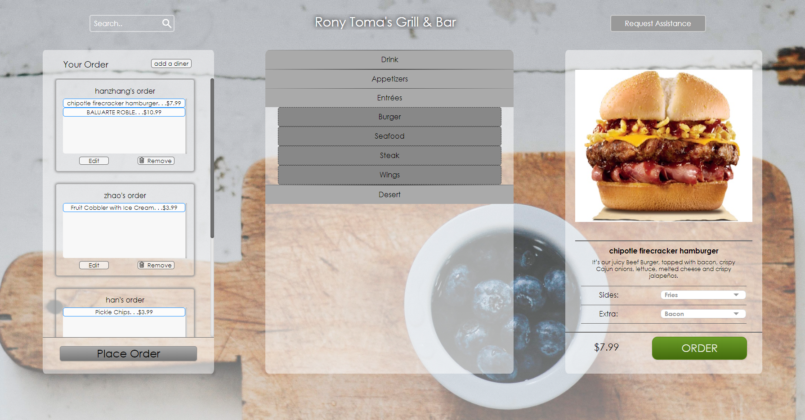

# Food-Ordering-System
A team project for COMP3020 Human-Computer Interaction.

A practice of simple graphical user interface design. HTML, CSS, JS, jQuery are used.

The application looks like this:

